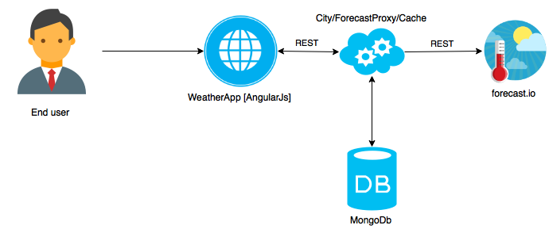

Frontend part
=============

* install `bower`
* install `bower install angular-bootstrap`


Weather REST API
================

Search city coordinates
-----------------

* request `GET /city/:cityName`
* response: 
    * {error: error_description}
    * [{city: cityName, attitude: coordinate, latitude: coordinate}, ...]

Get forecast by coordinates
------------------

* request `GET /forecast/:attitude/:latitude`
* response:
    * {error: error_description}
    * ```{
            latitude: 48.71278
            longitude: 32.66472
            timezone: "Europe/Kiev"
            offset: 2
            currently: {
                time: 1446994963
                summary: "Overcast"
                icon: "cloudy"
                precipIntensity: 0.0009
                precipProbability: 0.01
                precipType: "rain"
                temperature: 41.92
                apparentTemperature: 36.75
                dewPoint: 32.92
                humidity: 0.7
                windSpeed: 8.35
                windBearing: 216
                cloudCover: 1
                pressure: 1018.72
                ozone: 290.7
            }
            hourly: {
                summary: "Light rain starting later this evening, continuing until tomorrow morning."
                icon: "rain"
                data: [49]
            0:  {
                time: 1446994800
                summary: "Overcast"
                icon: "cloudy"
                precipIntensity: 0
                precipProbability: 0
                temperature: 41.94
                apparentTemperature: 36.84
                dewPoint: 32.88
                humidity: 0.7
                windSpeed: 8.24
                windBearing: 216
                cloudCover: 0.99
                pressure: 1018.77
                ozone: 290.65
            }```